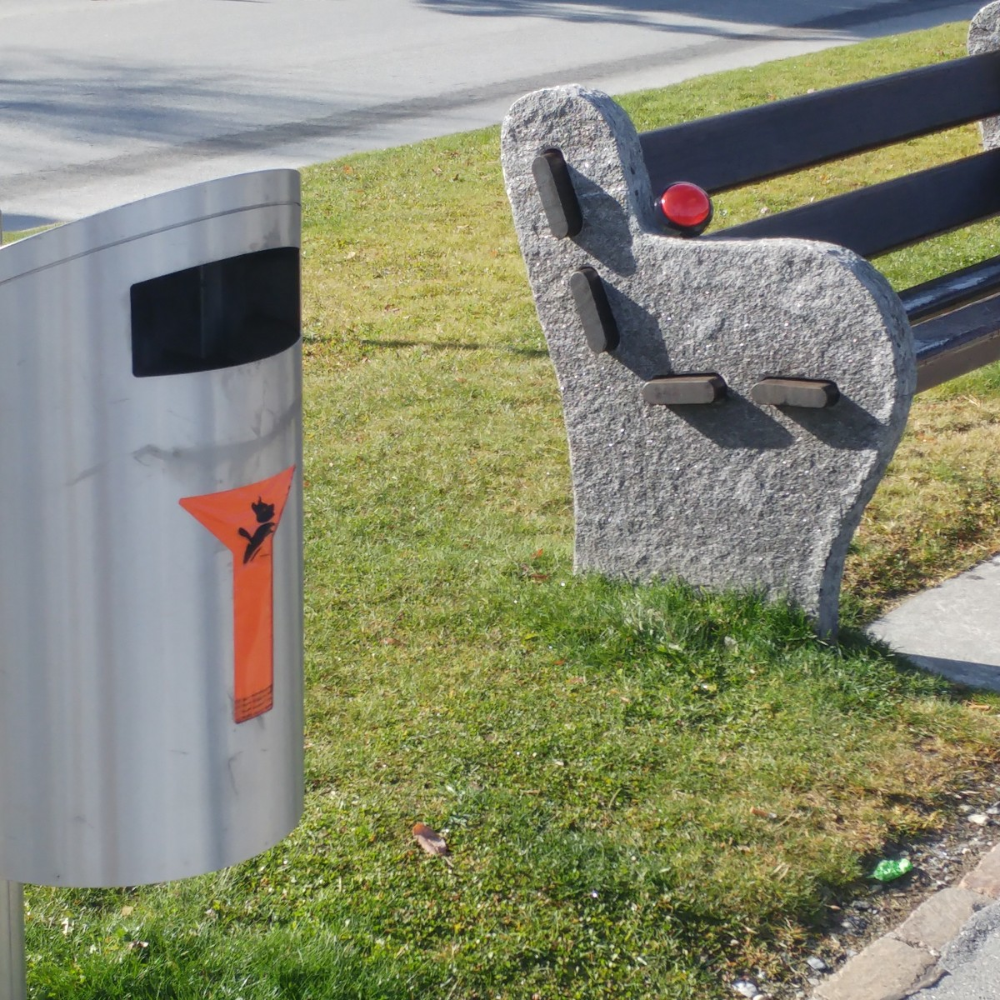
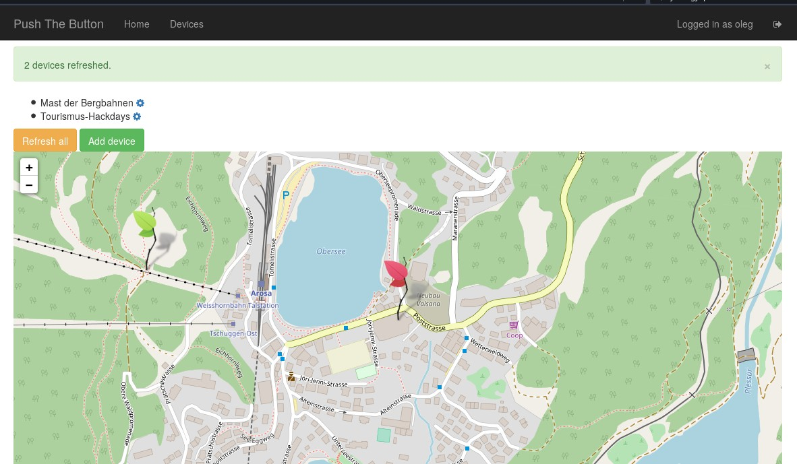
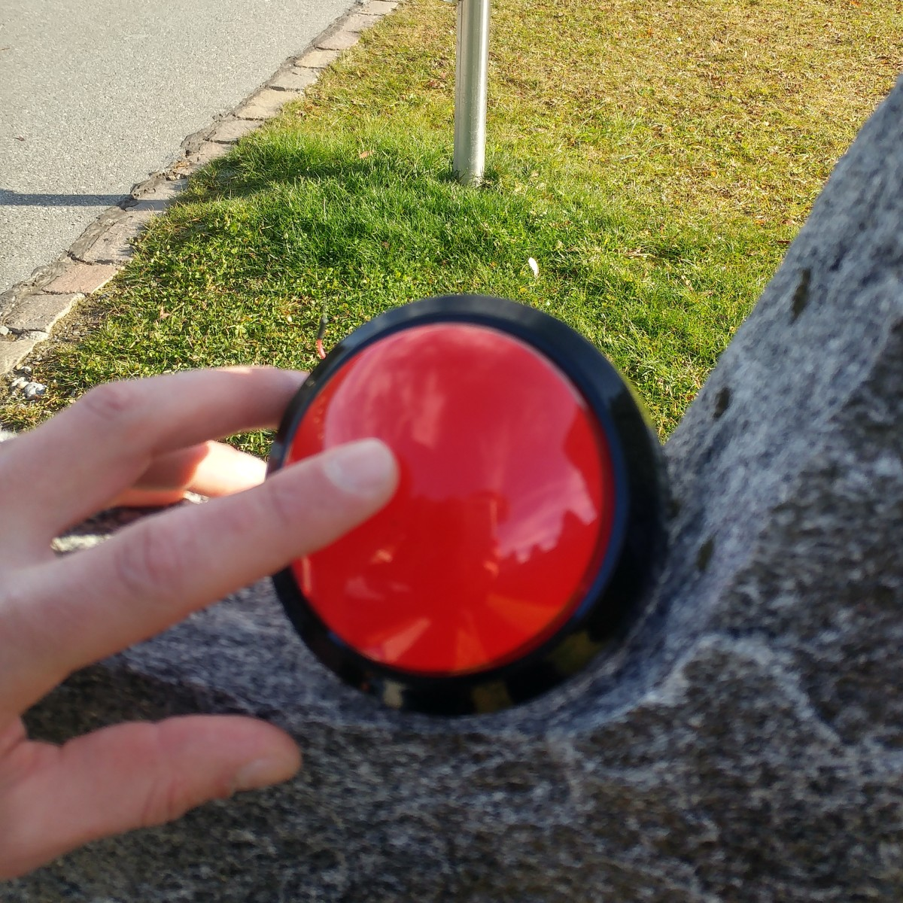
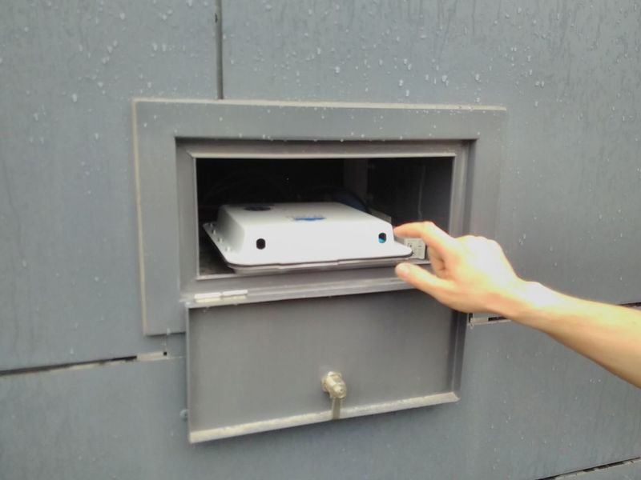
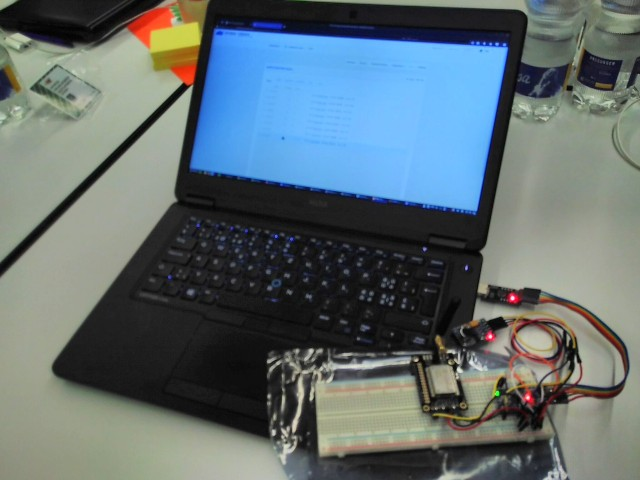
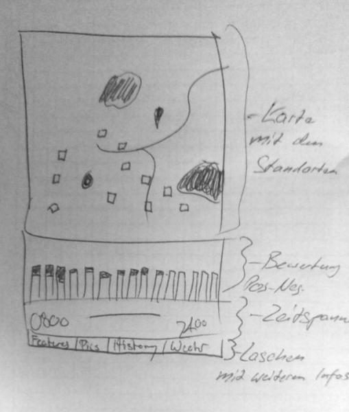
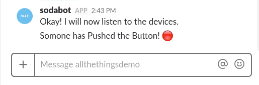

## Easy open satisfaction tracking for tourist regions

[ **[Die deutsche Version des Artikels ist hier auch verfügbar](README.md)** ]

This document describes the overall vision and implementation of our project for the [Open Tourism Data](http://tourism.opendata.ch) Hackdays 2017 in Arosa. The code is in two parts: the client [Node hardware and software](https://github.com/morgulbrut/opendata_lora_circuitpython) in one, and a [server repository](https://github.com/loleg/pushthebutton-server) which holds the Web application and monitoring components as detailed below.

- [Summary](#summary)
- [Field test](#field)
- [Technical implementation](#tech)
- [Web application](#webapp)
- [Inspiration and sources](#thanks)

# Summary

The trash can overflows? At the fireplace the wood is missing? Until now, your guests can only throw a fist at their bags. Now they can hit a smart button with that fist that triggers a message the community can react to. A direct and real-time customer survey is only one of the advantages offered by the Internet of Things in a tourism region. Thanks to a new nationwide and energy-saving network, it is now possible to realize novel services with modest financial resources.

## Background

The demands on tourism destinations have increased. Travelers attach great importance to well-functioning infrastructure. They expect information about the offers and the current situation in the area to be easily accessible. Thanks to new technology such as the wireless standard LoRaWAN as well as microcontrollers and sensors, such digital services can be set up today with comparatively low investment costs. An investment that could really pay off.

## Ideas

- **Push the Button.** So far, surveys on customer satisfaction are always made retrospectively. Why not ask the guests when and as they experience something - on the mountain top, at the grill, when visiting the bear park. The questions asked can be adapted as desired.
- **Data over the air.** How warm is the bathwater? How strong is the wind blowing on the top? The guests can retrieve the current measurement data of the sensors installed in the entire tourism area at any time on the Web.
- **Book it to my room.** Guests can use services anywhere or buy products anywhere - and have the costs booked directly to their hotel bill. To do this, they simply hold their RFID card on the appropriate payment terminal.
- **Surprise, Surprise!** You wish to spoil your sweetheart? Then order a bottle of sparkling wine on the top of the mountain. Nothing is easier than that: a badge is picked up at the front desk - a discrete swipe later, a drone brings in the surprise.

# Field test

Our goal was to take a device around the resort at the end of the Hackathon, "pressing the button" in various places. Using GPS data from a smartphone and the timestamp, the delay can be determined after the signal has arrived. Any passers-by will be asked their opinion about the basic idea.

Offers like these have several advantages:

- Guests benefit from additional services. Satisfaction increases when guests feel taken seriously.
- The maintenance of the infrastructure is simplified. For example, the tourguide can react immediately if guests are missing firewood at a grill spot, or if there are other problems with infrastructure somewhere. Information about the guests problems is always visible on a map. In addition, notifications can be sent to the appropriate staff.
- Tourism managers receive additional information about user behavior. For example, it is possible to ascertain which hiking trails are being used intensively - and which are not. An optimization can thus be justified.
- The development of such an infrastructure should lead to great media interest as well as many posts on the social networks. The resulting advertising effect should make up for the investment by far. Offers like "Surprise, Surprise!" are also ideal for advertising campaigns.
- The positive effect on the media as a "first mover" as a networked destination will also make other holiday regions emulate this innovative approach.

# Technical implementation

Data transmission takes place via established radio technology [Long Range Wide Area Network](https://en.wikipedia.org/wiki/Long_Range_Wide_Area_Network) (LoRaWAN). This data can be transmitted over very long distances with very low energy consumption. Satisfaction trackers can be placed anywhere - regardless of infrastructure, such as conventional mobile coverage and power availability. The data is received and processed by the non-commercial [The Things Network](https://www.thethingsnetwork.org). Thus there are no extra costs for the direct transfer.

For further technical questions, please contact the The Things Network community or inquire at the [Open Network Infrastructure Association](https://opennetworkinfrastructure.org/). If commercial support is required or if it is preferred that the gateway is not to be operated by the customer, such services can be purchased from [Swisscom](http://lpn.swisscom.ch/d/).

Below our temporary installation of the "The Things Network" in Arosa is described.

### Gateway

An new user community is installing gateway for [The Things Network](http://thethingsnetwork.com) around Switzerland. This receives the data sent by each Internet of Things node and processes it, forwarding it securely through the existing Internet connection. The one-off purchase cost for a [Gateway](https://shop.thethingsnetwork.com/index.php/product/the-things-gateway/) is currently around 350 francs. To cover the entire region, including the nearer parts of the ski area, two gateways are probably needed. The gateway is connected to the Internet via Ethernet. It also requires power (conventional or PoE via Ethernet cable).

#### Optimal locations

Where gateways can be installed, should be clarified in detail. The ideal locations are those with as many lines-of-sight as possible. We propose the locations marked on [this map](http://umap.osm.ch/de/map/lorawan-vorschlage-arosa_909#15/46.7844/9.6638) to start the discussion.

<Small>([full screen](http://umap.osm.ch/de/map/lorawan-vorschlage-arosa_909#15/46.7844/9.6638))</ small>

### Nodes

Transmitters ("Nodes") consist of a micro-board, a transmitter module and an antenna. The devices are spiked by a small battery. Sensors can be connected to these as required. Depending on the configuration and connected sensors, the devices can be operated for several months to a few years with one battery charge. A reduced battery charge is not a huge problem, when the locations of the sensors are already regularly controlled by employees of the destination.

#### Sensors

Depending on the application scenario, different sensors are put to use.

- Button, switch
- Light sensor
- Temperature and humidity sensor
- Microphone
- ... [and much more](https://en.wikipedia.org/wiki/List_of_sensors)

# Monitoring

In this project we created a basic functional Web dashboard for managing and monitoring nodes through The Things Network API. It was developed in [Python](http://python.org) using the [Flask](http://flask.pocoo.org/) microframework and various modules, a [Bootstrap](https://getbootstrap.com/ ) frontend and [cookiecutter](https://github.com/sloria/cookiecutter-flask/) was used.

After registering and logging in, you can use a simple form. They will appear on a map with a color change (green-yellow-red) based on the alert. The Refresh button obtains the latest status from each node in sequence.

See [DEPLOY.rst](DEPLOY.rst) for more technical details and deployment instructions for the Web application. Our sketch for the dashboard shows additional features (time series display, navigation, etc.) that we envisioned:

You can find the corresponding code for the Micropython node at [morgulbrut/opendata_lora_circuitpython](https://github.com/morgulbrut/opendata_lora_circuitpython).

A chatbot script was also quickly written in [Coffeescript](http://coffeescript.org/) to test mobile notifications through Slack at [loleg/sodabot](https://github.com/loleg/sodabot/blob/opentourism/scripts/onia.coffee).

# Sources of inspiration

Special thanks to Rochus A. Caluori from the Sports and Congress Center in Arosa for critical support during the Hackdays. Many thanks go to [Gonzalo Casas](http://twitter.com/gnz) and [Open Networking Infrastructure Association](https://opennetworkinfrastructure.org) for lending us material.

We were highly motivated and instructed thanks to these and many other prior projects:

- [MakeZurich 2017](http://now.makezurich.ch/event/1) (for all the Things!)
- [The Hiveeyes Project](https://hiveeyes.org/) (for openness)
- [Züri wie neu](https://www.zueriwieneu.ch/) (Report damage to the Zurich Infrastructure, based on [FixMyStreet](http://fixmystreet.org/))
- [Feedback button of Lobaro](http://feedback-button.de/) (a satisfaction tracker from Germany)
- [Feedback button from Proxidyne](https://proxidyne.com/products/lorawan-sensors/sensor-buttons/) (a satisfaction tracker from Chicago)
- [Mark-a-Spot](http://mark-a-spot.org/) and the [Open311 Standard](http://wiki.open311.org/Mark-a-Spot/)
- [Amazon Dash](https://www.amazon.com/Dash-Buttons/) (for the pervasiveness)
- [Drone delivered champagne](https://www.youtube.com/watch?v=ytqeBpYXtiw) (for the style)

# Team

- Mathias [@thisss](http://borniert.com/)
- Peter [@peterwyss](http://www.ist-edu.ch/de/https://opendata-ch.slack.com/messages/@U7QCJ0WNM)
- Tillo [@morgulbrut](https://github.com/morgulbrut)
- Oleg [@loleg](https://github.com/loleg)
