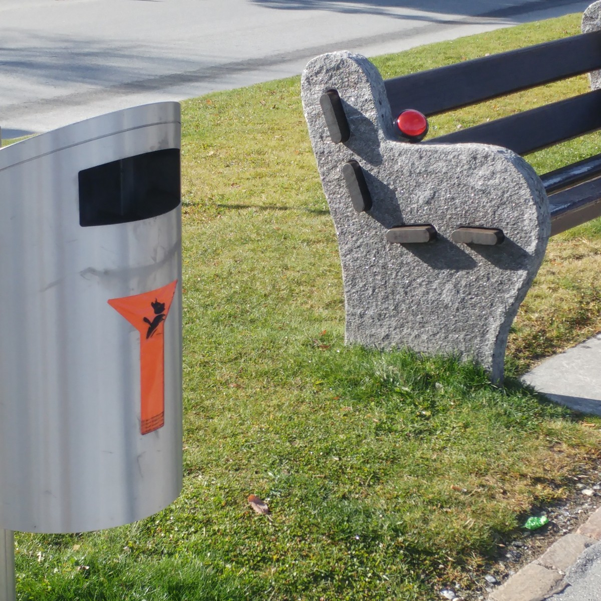
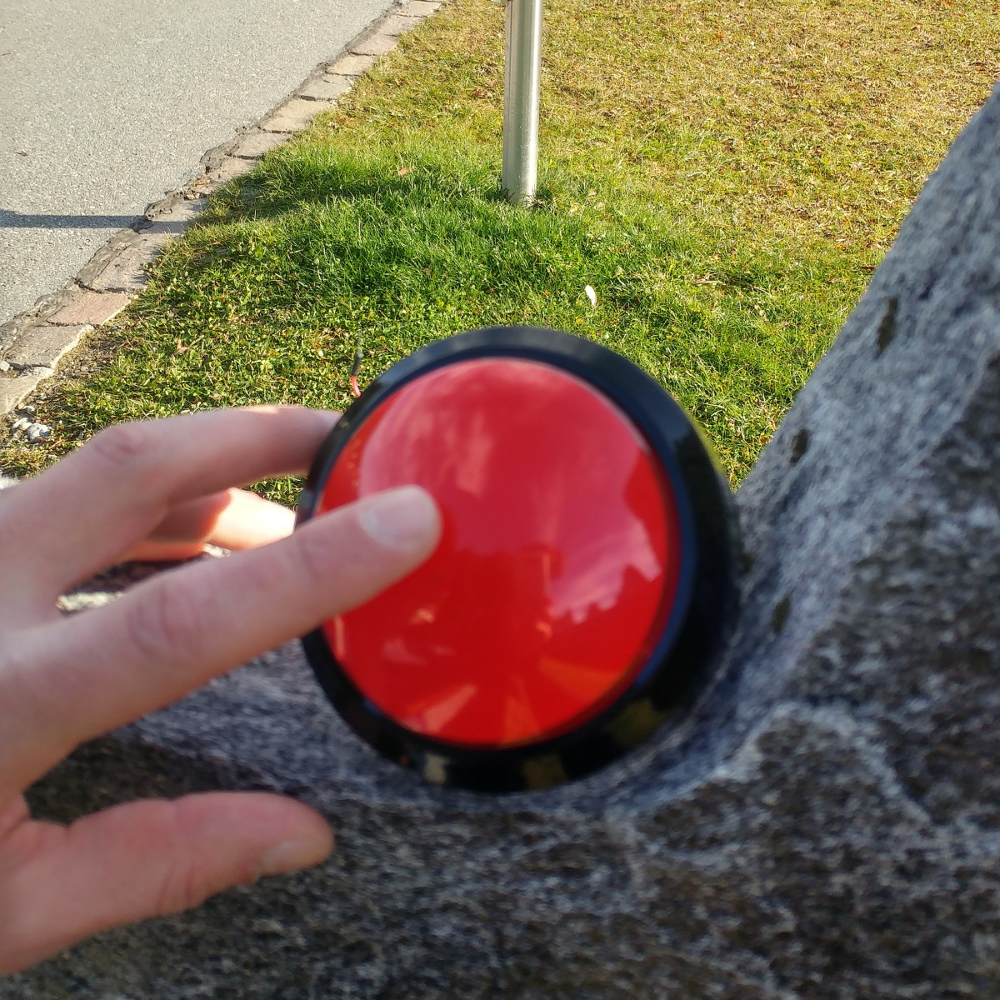
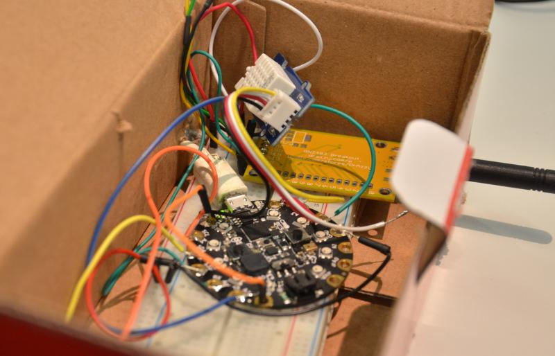
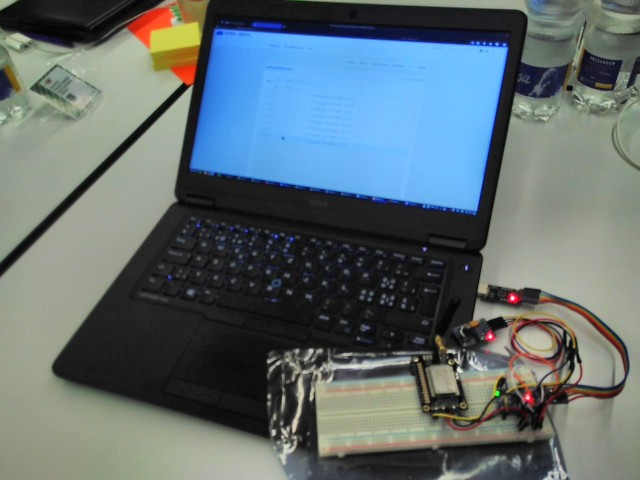
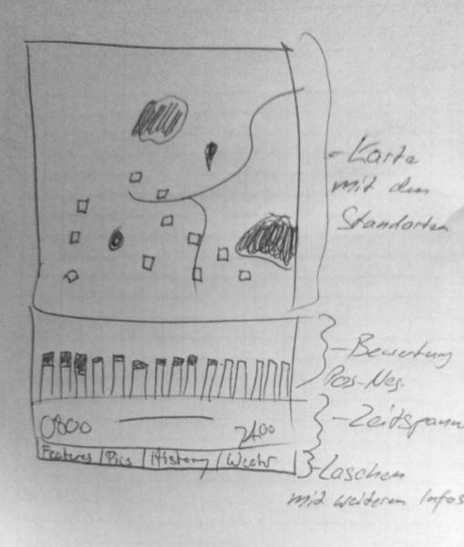

## Push the Button for happy tracking

**Der einfachste Zufriedenheitstracker für Tourismusregionen**

This document describes the overall vision and implementation of our project for the [Open Tourism Data](http://tourism.opendata.ch) Hackdays 2017 in Arosa. The code is in two parts: the client [Node hardware and software](https://github.com/morgulbrut/opendata_lora_circuitpython) in one, and a [server repository](https://github.com/loleg/pushthebutton-server) which holds the Web application and monitoring components as detailed below.

- [Zusammenfassung](#summary)
- [Feldtest](#field)
- [Technische Umsetzung](#tech)
- [Web application](#webapp)
- [Inspirationsquellen](#thanks)

# Zusammenfassung

Der Mülleimer quillt über? Bei der Feuerstelle fehlt das Holz? Bislang machten viele Gäste die Faust im Sack. Neu hauen sie höchstens mit der Faust auf den Knopf. Schon ist die Gemeinde über den Missstand informiert und kann ihn beheben. Die unmittelbare Kundenbefragung ist aber nur ein Vorteil, den das Internet der Dinge einer Tourismusregion bietet. Dank eines flächendeckenden und energiesparenden Netzwerkes lassen sich mit bescheidenen finanziellen Mitteln auch neuartige Dienstleistungen realisieren.

## Hintergrund

Die Anforderungen an die Tourismusdestinationen sind gestiegen. Grossen Wert legen die Gäste insbesondere auf eine gut funktionierende Infrastruktur. Und sie erwarten, dass Informationen zu den Angeboten und zur aktuellen Situation im Gebiet problemlos zugänglich sind. Dank neuer Technologie wie dem Funkstandard LoRaWAN sowie Mikrokontrollern und Sensoren lassen sich solche Dienstleistungen heute mit vergleichsweise tiefen Investitionskosten aufbauen. Eine Investition, die sich auszahlen könnte.

## Ideen

- **Push the Button.** Bislang werden Umfragen zur Kundenzufriedenheit stets nachträglich gemacht. Weshalb befragt man die Gäste nicht dann, wenn sie etwas erleben -- auf dem Berggipfel, bei der Brätlistelle, beim Besuch des Bärenparks. Die Fragen können beliebig angepasst werden.
- **Data over the air.** Wie warm ist der Badeweiher? Wie stark weht der Wind auf dem Gipfel? Die Gäste können die aktuellen Messdaten der im gesamten Tourismusgebiet installierten Sensoren jederzeit im Web abrufen.  
- **Book it to my Room.** Die Gäste können an beliebigen Orten Dienstleistungen in Anspruch nehmen oder Produkte kaufen -- und die Kosten direkt auf die Hotelrechnung buchen lassen. Dazu halten sie lediglich ihre RFID-Karte aufs entsprechende Bezahlterminal.
- **Surprise, Surprise!** Sie möchten die Liebste ganz besonders verwöhnen? Dann bestellen Sie eine Flasche Sekt auf den Berggipfel. Nichts ist einfacher als das: Der Batch wird an die Bestellsäule gehalten -- wenig später bringt eine Drohne die Überraschung.

# Feldtest

Das Ziel ist, am Ende des Hackatlons einen Gerät mitzunehmen und an diversen Orten den Knopf zu drücken. Mittels GPS Daten von einem Smartphone und dem Zeitpunkt sowie einer Numerierung kann danach eruiert werden, ob das Signal angekommen ist.
Nach Möglichkeit werden Passanten nach ihrer Meinung über die Grundidee befragt.

Angebote wie diese bieten diverse Vorteile:

- Die Gäste profitieren von zusätzlichen Dienstleistungen. Die Zufriedenheit steigt, wenn sich Gäste ernst genommen fühlen.
- Die Wartung der Infrastruktur wird vereinfacht. So kann etwa der Wegmeister sofort reagieren, wenn Gäste bei einer Brätlistelle das Brennholz vermissen oder wenn irgendwo Probleme mit der Infrastruktur bestehen. Wo gemäss den Angaben der Gäste Probleme bestehen, ist jederzeit auf einer Karte ersichtlich. Zudem können Notifikationen verschickt werden.
- Die Tourismusverantwortlichen erhalten zusätzliche Informationen zum Nutzerverhalten. So lässt sich etwa erheben, welche Wanderwege besonders intensiv genutzt werden -- und welche nicht. Eine Optimierung kann somit gerechtfertigt werden.
- Der Aufbau einer solchen Infrastruktur dürfte auf grosses Medieninteresse sowie vielen Posts auf den sozialen Netzwerken führen. Der dadurch erzielte Werbeeffekt dürfte die Investitionen bei Weitem wett machen. Angebote wie "Surprise, Surprise!" eignen sich zudem vortrefflich für Werbekampagnen.
-  Der positive Effekt auf die Medien als "First Mover" als eine vernetzte Destination wird auch andere Ferienregionen zum nachahmen bewegen.

# Technische Umsetzung

Die Datenübertragung erfolgt über die Funktechnik [LoRaWAN](https://de.wikipedia.org/wiki/Long_Range_Wide_Area_Network). Damit können Daten bei sehr geringem Energieverbrauch über grosse Distanzen übermittelt werden. Damit können Zufriedensheitstracker an beliebigen Stellen platziert werden -- unabhängig von Infrasturktur wie konventioneller Mobilnetzabdeckung und Stomverfügbarkeit. Der Empfang und die Verarbeitung der Daten erfolgt durch das nicht kommerzielle [The Things Network](https://www.thethingsnetwork.org). Damit fallen für die unmittelbare Übertragung keine Extrakosten an.

Bei technischen Fragen kann in der "The Things Network"-Gemeinschaft nachgefragt oder bei der [Open Network Infrastructure Association](https://opennetworkinfrastructure.org/) nachgefragt werden. Ist kommerzieller Support nötig oder soll der Gateway nicht selber betrieben werden, können die Übertragungsleistungen bei der [Swisscom](http://lpn.swisscom.ch/d/) eingekauft werden. Nachfolgend wird eine Installation mit dem "The Things Network" beschrieben.

### Gateway

Die Gemeinde installiert einen Gateway für ["The Things Network"](http://thethingsnetwork.com). Dieser empfängt die Daten, die von den einzelnen Nodes gesendet werden, und verarbeitet sie. Die einmaligen Anschaffungskosten für den [Gateway](https://shop.thethingsnetwork.com/index.php/product/the-things-gateway/) betragen derzeit rund 350 Franken. Zur Abdeckung der gesamten Region inklusive der näheren Teile des Skigebiets sind vermutlich zwei Gateways nötig. Der Gateway wird via Ethernet ans Internet angeschlossen. Benötigt wird zudem Strom (konventionell oder auch übers Ethernet-Kabel).  

#### Optimale Standorte

Wo die Gateways installiert werden können, müsste im Detail abgeklärt werden. Ideal sind Standorte, zu denen von möglichst vielen Punkten eine Sichtverbindung besteht. Diskutiert werden könnte etwa über die auf [dieser Karte markierten Standorte](http://umap.osm.ch/de/map/lorawan-vorschlage-arosa_909#15/46.7844/9.6638).

<small>([Vergrössern](http://umap.osm.ch/de/map/lorawan-vorschlage-arosa_909#15/46.7844/9.6638))</small>

### Nodes

Die Sendegeräte bestehen aus einer Mikro-Platine sowie einem Sendemodul und einer Antenne. Gespiesen werden die Geräte durch einen kleinen Akku. An diese können je nach Bedarf Sensoren angeschlossen werden. Je nach Konfiguration und angeschlossenen Sensoren können die Geräte mehrere Monate bis zu wenigen Jahren mit einer Akkuladung betrieben werden. Wobei auch eine verkürzte Akkuladung kein Problem darstellt, da die Standorte der Sensoren ohnehin regelmässig von Mitarbeiter der Destination kontrolliert wird.

#### Sensoren

Je nach Einsatzsznario kommen unterschiedliche Sensoren zum Einsatz.

- Knopf, Schalter
- Lichtsensor
- Temperatur- und Feuchtigkeitssensor
- Mikrofon
- ...[und vieles mehr](https://en.wikipedia.org/wiki/List_of_sensors)

# Web Application

This project contains a basic, but fully functional Web dashboard for managing and monitoring nodes connected through The Things Network API. It was developed in [Python](http://python.org) using the [Flask](http://flask.pocoo.org/) microframework and various modules, [Bootstrap](https://getbootstrap.com/) frontend, and [cookiecutter](https://github.com/sloria/cookiecutter-flask/) by sloria.

After registering and logging in, you can add devices using a simple form. They will appear on a map as pins with a status color that changes (green-yellow-red) based on the alert. The Refresh button obtains the latest status from each node in sequence.

See [DEPLOY.rst](DEPLOY.rst) for more technical details and deployment instructions of the Web application.

You can find the corresponding code for the Micropython node at [morgulbrut/opendata_lora_circuitpython](https://github.com/morgulbrut/opendata_lora_circuitpython).

A chatbot script we quickly wrote in [Coffeescript](http://coffeescript.org/) to test notifications through Slack is at [loleg/sodabot](https://github.com/loleg/sodabot/blob/opentourism/scripts/onia.coffee).

Here is our sketch for the dashboard, showing additional features (time series display, navigation, etc.) that we envision:

# Inspirationsquellen

Ein besonderen Dank an Rochus A. Caluori von der Sport- und Kongresszentrum Arosa für seine kritische Unterstützung während den Hackdays. Vielen Dank an [Gonzalo Casas](http://twitter.com/gnz) und [Open Networking Infrastructure Association](https://opennetworkinfrastructure.org) für die Materialausleihe und support.

Wir sind dank diesen und vielen anderen Projekten sehr motiviert und instruiert geworden:

- [The Hiveeyes Project](https://hiveeyes.org/) (für die Offenheit)
- [Züri wie neu](https://www.zueriwieneu.ch/) (Melden von Schäden an der Zürcher Infrastruktur, basiert auf [FixMyStreet](http://fixmystreet.org/))
- [Feedback-Button von Lobaro](http://feedback-button.de/) (ein Zufriedenheitstracker aus Deutschland)
- [Feedback-Button von Proxidyne](https://proxidyne.com/products/lorawan-sensors/sensor-buttons/) (ein Zufriedenheitstracker aus Chicago)
- [Mark-a-Spot](http://mark-a-spot.org/) und der [Open311 Standard](http://wiki.open311.org/Mark-a-Spot/)
- [Amazon Dash](https://www.amazon.com/Dash-Buttons/) (for the pervasiveness)
- [Drohnen bringen Champagner](https://www.youtube.com/watch?v=ytqeBpYXtiw)

# Team

- Mathias [@thisss](http://borniert.com/)
- Peter [@peterwyss](http://www.ist-edu.ch/de/https://opendata-ch.slack.com/messages/@U7QCJ0WNM)
- Tillo [@morgulbrut](https://github.com/morgulbrut)
- Oleg [@loleg](https://github.com/loleg)
